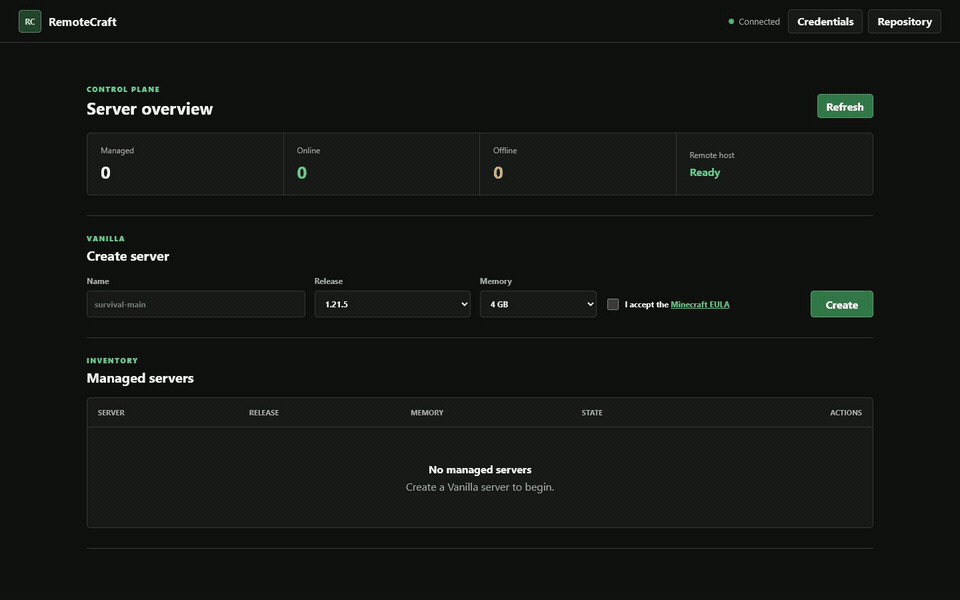
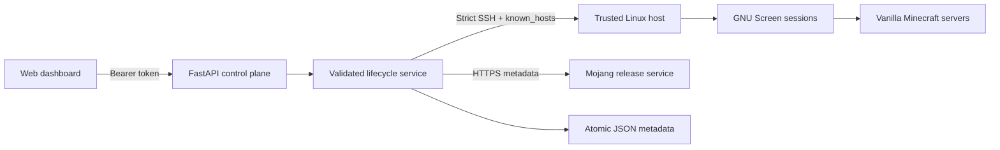

# RemoteCraft

[](https://github.com/zaydzaari/RemoteCraft/actions/workflows/ci.yml)
[](https://www.python.org/)
[](LICENSE)
[](#project-status)

RemoteCraft is a lightweight, security-first control plane for people who already own a
Linux VPS and want to manage Vanilla Minecraft servers without Docker or a heavyweight
hosting panel. It pairs a FastAPI backend with a focused web dashboard for provisioning
servers, controlling their lifecycle, reading logs, and sending console commands over a
strict SSH boundary.



> [!IMPORTANT]
> RemoteCraft is alpha software. Keep it bound to loopback or behind a properly secured
> HTTPS reverse proxy. Do not expose the development server directly to the internet.

## Why this project exists

RemoteCraft explores a practical systems problem: how can a small web application manage
long-running game processes on another machine without turning arbitrary user input into
arbitrary shell access?

The implementation uses a deliberately narrow command surface, strict input validation,
shell quoting, verified Mojang downloads, explicit EULA acceptance, and SSH host-key
verification. It does not provide a general-purpose terminal.

## Features

- Create Vanilla servers from Mojang's official release metadata.
- Verify every downloaded server JAR against Mojang's SHA-1 checksum.
- Start, stop, restart, force-stop, and delete managed servers.
- Read recent server logs and send Minecraft console commands.
- Authenticate API requests with a bearer token.
- Store the browser token in `sessionStorage`, not in source code or persistent storage.
- Reject unknown SSH hosts using a configured `known_hosts` file.
- Persist server metadata with validated, atomic JSON writes.
- Poll server state without opening SSH when the inventory is empty.

## Architecture



The API accepts structured operations only. The service converts those operations into a
small set of quoted remote commands. Server paths are generated beneath one configured
root, and deletion is refused when a stored path is outside that root.

## Requirements

### Control plane

- Python 3.11 or newer
- Network access to the Linux host over SSH
- An SSH key, password, or agent identity for a dedicated remote user
- A verified `known_hosts` entry for that host

### Managed Linux host

- Java 21 or the Java version required by your chosen Minecraft release
- GNU Screen
- `curl`
- `sha1sum`
- A dedicated user that owns the configured server root

For Ubuntu, a basic host setup looks like this:

```bash
sudo apt update
sudo apt install -y openjdk-21-jre-headless screen curl
sudo useradd --system --create-home --shell /bin/bash minecraft
sudo install -d -o minecraft -g minecraft -m 0750 /srv/minecraft
```

Configure key-based SSH access for the `minecraft` user. Verify the host fingerprint
through your provider console before adding it to `known_hosts`.

## Two-minute install

The guided installer checks the control-plane requirements, confirms the VPS SSH
fingerprint, tests key or agent authentication, verifies the remote tools and server root,
installs RemoteCraft, writes a private configuration, and starts a user-level systemd
service when available.

```bash
bash <(curl -fsSL https://raw.githubusercontent.com/zaydzaari/RemoteCraft/main/scripts/install.sh)
```

The script never installs remote packages, accepts a password, or trusts an SSH host key
silently. Verify the displayed fingerprint through your VPS provider console before
typing `YES`.

To inspect the installer before running it:

```bash
curl -fsSLO https://raw.githubusercontent.com/zaydzaari/RemoteCraft/main/scripts/install.sh
less install.sh
bash install.sh
```

After installation, open `http://127.0.0.1:8000` and enter the API token printed by the
installer. For a remote control plane, use the SSH tunnel shown below.

## Manual setup

1. Clone the repository and create a virtual environment.

   ```bash
   git clone https://github.com/zaydzaari/RemoteCraft.git
   cd RemoteCraft
   python -m venv .venv
   source .venv/bin/activate
   python -m pip install --upgrade pip
   python -m pip install .
   ```

2. Create the local configuration.

   ```bash
   cp .env.example .env
   python -c "import secrets; print(secrets.token_urlsafe(48))"
   ```

3. Put the generated token and your SSH connection values in `.env`.

   ```dotenv
   REMOTECRAFT_API_TOKEN=replace-with-your-generated-token
   REMOTECRAFT_SSH_HOST=minecraft.example.com
   REMOTECRAFT_SSH_PORT=22
   REMOTECRAFT_SSH_USER=minecraft
   REMOTECRAFT_SSH_KEY_PATH=~/.ssh/id_ed25519
   REMOTECRAFT_SSH_USE_AGENT=true
   REMOTECRAFT_KNOWN_HOSTS_PATH=~/.ssh/known_hosts
   REMOTECRAFT_SERVERS_ROOT=/srv/minecraft
   REMOTECRAFT_MAX_RAM_GB=16
   ```

4. Start RemoteCraft.

   ```bash
   remotecraft
   ```

5. Open `http://127.0.0.1:8000`, select **Credentials**, and enter the configured API
   token.

RemoteCraft binds to `127.0.0.1` by default. When it runs on another machine, use an SSH
tunnel rather than opening the port publicly:

```bash
ssh -L 8000:127.0.0.1:8000 user@control-plane.example.com
```

Then open `http://127.0.0.1:8000` on your local computer.

## Configuration

| Variable | Required | Default | Purpose |
| --- | --- | --- | --- |
| `REMOTECRAFT_API_TOKEN` | Yes | None | Bearer token, at least 32 characters |
| `REMOTECRAFT_SSH_HOST` | Yes | None | Managed Linux host |
| `REMOTECRAFT_SSH_PORT` | No | `22` | SSH port |
| `REMOTECRAFT_SSH_USER` | Yes | None | Dedicated remote user |
| `REMOTECRAFT_SSH_PASSWORD` | Conditional | None | Password authentication |
| `REMOTECRAFT_SSH_KEY_PATH` | Conditional | None | Private-key authentication |
| `REMOTECRAFT_SSH_USE_AGENT` | No | `true` | Allow agent and local key discovery |
| `REMOTECRAFT_KNOWN_HOSTS_PATH` | No | `~/.ssh/known_hosts` | Trusted SSH host keys |
| `REMOTECRAFT_SERVERS_ROOT` | No | `/srv/minecraft` | Parent directory for managed servers |
| `REMOTECRAFT_DATA_DIR` | No | `./data` | Local metadata and release cache |
| `REMOTECRAFT_MAX_RAM_GB` | No | `16` | Per-server API limit |
| `REMOTECRAFT_BIND_HOST` | No | `127.0.0.1` | HTTP bind address |
| `REMOTECRAFT_PORT` | No | `8000` | HTTP port |
| `REMOTECRAFT_ALLOWED_ORIGINS` | No | Empty | Comma-separated CORS origins |

At least one SSH authentication method must be enabled. If `known_hosts` is missing or
does not contain the host, the connection fails closed.

## API surface

All routes except health require `Authorization: Bearer <token>`.

| Method | Route | Operation |
| --- | --- | --- |
| `GET` | `/api/health` | Process health and version |
| `GET` | `/api/host` | Check required tools on the remote host |
| `GET` | `/api/versions` | List recent Vanilla releases |
| `GET` | `/api/servers` | List managed servers and current state |
| `POST` | `/api/servers` | Create and verify a Vanilla server |
| `POST` | `/api/servers/{id}/start` | Start a server |
| `POST` | `/api/servers/{id}/stop` | Request a graceful stop |
| `POST` | `/api/servers/{id}/restart` | Stop and start a server |
| `POST` | `/api/servers/{id}/kill` | Force-stop the Screen session |
| `POST` | `/api/servers/{id}/command` | Send one console command |
| `GET` | `/api/servers/{id}/logs` | Read the latest log lines |
| `DELETE` | `/api/servers/{id}` | Delete an offline server after name confirmation |

Example health check:

```bash
curl http://127.0.0.1:8000/api/health
```

## Security model

- RemoteCraft assumes one trusted operator and one trusted Linux host.
- The bearer token protects the API but is not a replacement for HTTPS on an untrusted
  network.
- Dynamic shell values are validated and quoted before execution.
- The service downloads only trusted HTTPS URLs returned by approved Mojang hosts.
- Unknown SSH host keys are rejected; `AutoAddPolicy` is never used.
- API responses use `Cache-Control: no-store` and conservative browser security headers.
- The dashboard never embeds an API token. It keeps the operator-provided token only for
  the current browser session.

See [SECURITY.md](SECURITY.md) for vulnerability reporting and deployment guidance.

## Development

Install the development dependencies and run the checks used by CI:

```bash
python -m pip install -e ".[dev]"
ruff format --check .
ruff check .
pytest --cov=remotecraft --cov-report=term-missing
python -m build
pip-audit --skip-editable
bash -n scripts/install.sh
bash tests/install_smoke.sh
```

The test suite uses fake SSH sessions. It covers API authentication, command quoting,
download verification, lifecycle transitions, safe deletion, metadata persistence,
Mojang cache behavior, and strict SSH host-key policy without connecting to a real server.

## Roadmap and community

The public [roadmap](ROADMAP.md) tracks the intentionally small next steps. Use
[Discussions](https://github.com/zaydzaari/RemoteCraft/discussions) for setup questions and
design ideas, or choose a structured [issue form](https://github.com/zaydzaari/RemoteCraft/issues/new/choose)
for reproducible bugs and focused feature requests. Contributions are welcome; see
[CONTRIBUTING.md](CONTRIBUTING.md) before opening a pull request.

Release history is documented in [CHANGELOG.md](CHANGELOG.md).

## Project status

RemoteCraft `0.2.1` is an alpha release focused on one complete workflow: managing Vanilla
Minecraft servers on one Linux host. It intentionally does not claim support for Paper,
Spigot, Fabric, Forge, backups, player administration, multi-user RBAC, or clustered hosts.

Potential next steps include replacing GNU Screen with user-level systemd units, adding
backup policies, exposing read-only performance telemetry, and supporting multiple hosts
through an explicit inventory model.

## License

RemoteCraft is available under the [MIT License](LICENSE).
